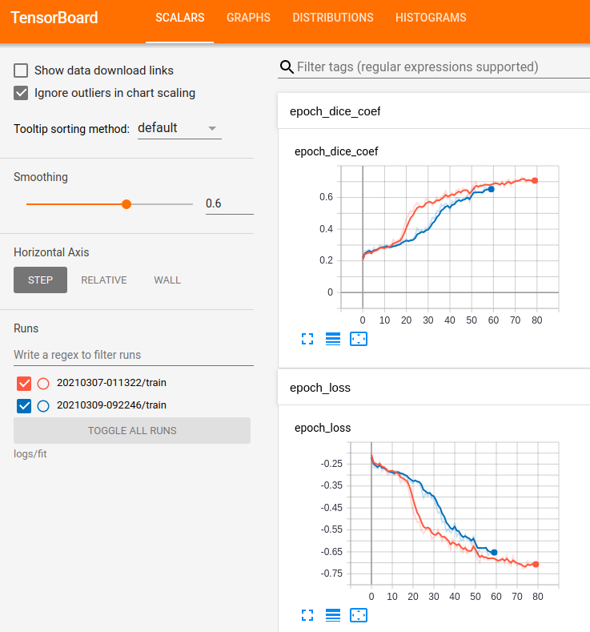

# U-net-for-Multi-class-semantic-segmentation

 This example demonstrates the use of U-net model for pathology segmentation on retinal images. This supports binary and multi-class segmentation.

# This jupyter notebook presents all requirements needed to achieve pixel-level semantic segmentation using images. 


# Step 1: Package requirements
Tensorflow>=2.0
numpy
skimage.io
skimage.transform

# Step 2: Train and Test Data
Download the DIARETDB1 data set page:
* Downliad the annotated data at http://www2.it.lut.fi/project/imageret/diaretdb1/
* We will use the images in folder: ddb1fundusimages, and annotations in folder: ddb1groundtruth
* Create tho folders train and test, such that train has images 1-27 and test has all remaining images.
* Create the following folder structure in your local folder for multi-class segmentation. :
```
    ./resources/
            │
            └───train
            |    └───images
            |    └───GT
            |          └───hardexudates
            |          └───softexudates
            |          └───hamorrhages
            |          └───redsmalldots
            │
            └───test
                ├──images
        
   ```
 For binary segmentation, only the hamorrhages folder is retained under GT.
 # Step 3: Get the code
 Download the code in the code folder. 
 * The U-net_binary.ipynb performs binary classification for hamorrhages. 
 * The One-Hot-encoded_GT_creation_3_classes.ipynb creates the multi-class classification groundtruth
 * The U-net_multi-class_DB1.ipynb implements the multi-class U-net implementation.
 
 # Step 4: Results:
 * The U-net with Depth 4 is trained using 27 images, loss function of negative dice coefficient, Adam optimizer and augmented significnatly using the keras imagedata generator.
 * The tensorboard graphs are as follows:
 
 
 ## The segmentation perfromances on test images are: 
  
 * Sample examples are:
 Predicted output:  
 * Other outputs under Multi-class/test/pred/
 

          
          
      

