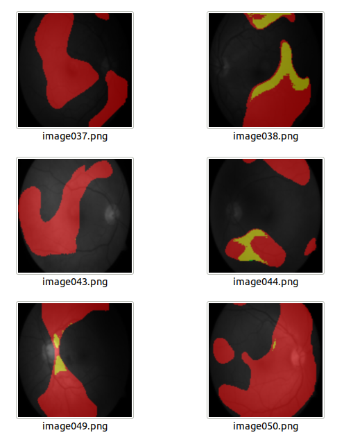

# U-net-for-Multi-class-semantic-segmentation

 This example demonstrates the use of U-net model for pathology segmentation on retinal images. This supports binary and multi-class segmentation.
 
# Google Colab support

The Google colab folder contains code to help replicate the process for the DIARETDB1 data set. The folder structures are automatically created using the Step 1 code and the U-net is implemented using the Step 2 code.

# This jupyter notebook presents all requirements needed to achieve pixel-level semantic segmentation using images. 

# Step 1: Package requirements
* Tensorflow>=2.0
* numpy
* skimage.io
* skimage.transform

# Step 2: Train and Test Data
Download the DIARETDB1 data set page:
* Downliad the annotated data at http://www2.it.lut.fi/project/imageret/diaretdb1/
* We will use the images in folder: ddb1fundusimages, and annotations in folder: ddb1groundtruth
* Create tho folders train and test, such that train has images 1-27 and test has all remaining images.
* Create the following folder structure in your local folder for multi-class segmentation. :
```
    ./resources/
            │
            └───train
            |    └───images
            |    └───GT
            |          └───hardexudates
            |          └───softexudates
            |          └───hamorrhages
            |          └───redsmalldots
            │
            └───test
                ├──images
        
   ```
 For binary segmentation, only the hamorrhages folder is retained under GT.
 # Step 3: Get the code
 Download the code in the code folder. 
 * The U-net_binary.ipynb performs binary classification for hamorrhages. 
 * The One-Hot-encoded_GT_creation_3_classes.ipynb creates the multi-class classification groundtruth
 * The U-net_multi-class_DB1.ipynb implements the multi-class U-net implementation.
 
 # Step 4: Results:
 * The U-net with Depth 4 is trained using 27 images, loss function of negative dice coefficient, Adam optimizer and augmented significnatly using the keras imagedata generator.
 * The tensorboard graphs are as follows:
 
 
 # How to avoid possible errors?
 The key component of this U-net framework is that input is an image and output is also an image. 
 To use the code in this repo AS IS, you HAVE TO unpack the data set as suggested in Step 2.
 * One way to detect if your Path is incorrectly set is, you will get the message: "Found 0 images beloning to 1 classes". This means the images and GT are not detected. 
 * If images are not detected, this will lead to a "peek" error while model.fit command is run. 
* Finally, for tensorboard, if no visualization is created, check the 'logs' folder. If a recored exists then rerun the tensorboard command. This should get things started.
 
 ## The segmentation perfromances on test images are: 
  
 * Sample examples are:
 Predicted output:  
 * Other outputs under Multi-class Segmentation/pred/
 

          
          
      

